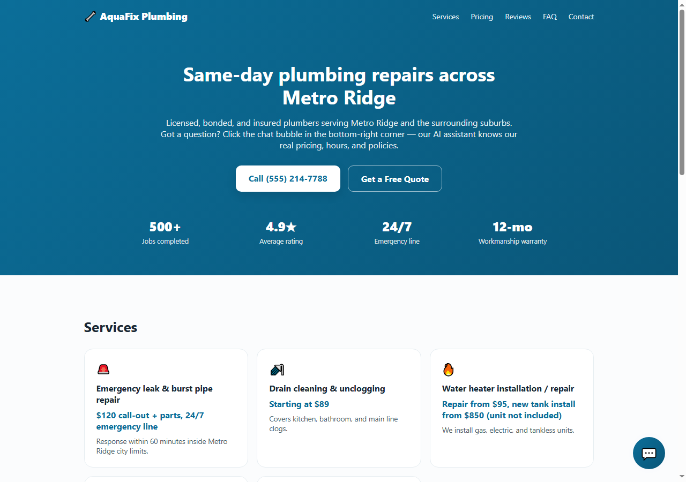
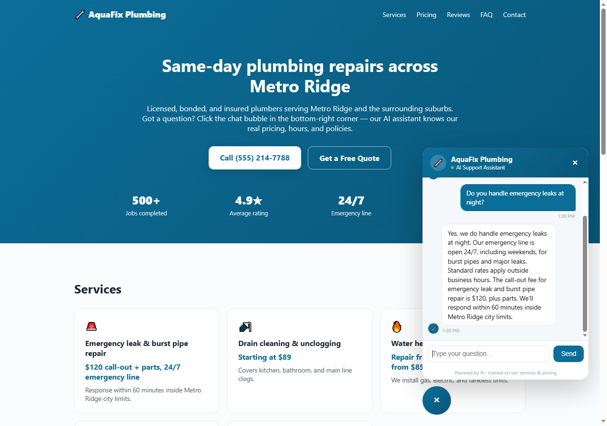

# AquaFix Plumbing — AI Customer Support Chat Widget

## About This Project

Most small businesses don't need a full AI product — they need one thing: a chatbot on their website that actually knows their prices, hours, and policies instead of giving generic, made-up answers. This project is a portfolio build showing exactly that service end-to-end.

It's a complete, working example: a small business website ("AquaFix Plumbing," a fictional plumbing company) with a floating AI chat widget in the bottom-right corner. Ask it about pricing, hours, service area, or emergency callouts, and it answers from that business's real data — not a generic ChatGPT wrapper. Ask it something outside that scope (like car repair), and it correctly says so and hands off to a human instead of making something up.

The point of building it this way — a real site plus a portable widget plus a documented backend — is to demonstrate the actual deliverable a client buys: "add AI chat to my existing site," not a AI chatbot in isolation.

## Live Demo

- Site: [ai-support-chatbot-plum.vercel.app](https://ai-support-chatbot-plum.vercel.app/)
- Plain-HTML embed example: [ai-support-chatbot-plum.vercel.app/embed-demo.html](https://ai-support-chatbot-plum.vercel.app/embed-demo.html)

## Screenshots

**Homepage with the AI chat widget**



**The widget answering a real question, grounded in the business's own data**



## Tech Stack

- **Frontend:** React (embeddable `ChatWidget` component) + a vanilla-JS embeddable build (`public/widget.js`) that works on any site via a single `<script>` tag
- **Demo site:** Next.js (App Router)
- **Backend:** Node API route (`app/api/chat/route.js`) — knowledge-base injection + LLM call
- **LLM:** Groq (Llama 3.3 70B, free tier) by default, with Claude (Anthropic) or OpenAI as drop-in alternatives
- **Deployment:** Vercel

## How It Works

1. The knowledge base (`lib/knowledgeBase.js`) holds the business's real data — services, pricing, hours, service area, policies, FAQs — as plain structured data.
2. On every chat request, that knowledge base is flattened to text and injected directly into the system prompt (`lib/systemPrompt.js`), along with an instruction to answer *only* from that context and hand off to a human for anything outside it.
3. This is "RAG-lite": at this scale (a few KB of text) there's no need for chunking, embeddings, or a vector database — the whole knowledge base fits in the prompt on every call. The same pattern scales up later by swapping the injection step for a real retrieval step without touching the widget or API contract.
4. `app/api/chat/route.js` receives the conversation, builds the system prompt, and calls the LLM (Groq by default, or Anthropic/OpenAI if configured — or a local keyword-matching fallback if no API key is set at all, so the demo still works with zero configuration).
5. The React widget (`components/ChatWidget.js`) and the vanilla-JS widget (`public/widget.js`) are two front-ends for the same backend — proving the same AI support layer can sit inside a Next.js app *or* be dropped into any existing website (WordPress, Shopify, static HTML) with one script tag.

```
Business data (lib/knowledgeBase.js)
        │
        ▼
System prompt injection (lib/systemPrompt.js)
        │
        ▼
POST /api/chat  →  Groq / Claude / OpenAI  →  reply
        │
        ▼
ChatWidget (React)  or  widget.js (vanilla, any site)
```

## Running Locally

```bash
npm install
npm run dev
```

Open `http://localhost:3000`. Without any API key set, the widget runs in **demo mode** — a local keyword-retrieval fallback over the same knowledge base, so it works immediately with zero setup.

To use a real LLM, copy `.env.example` to `.env.local` and add a key. The free option is **Groq**:

1. Go to [console.groq.com/keys](https://console.groq.com/keys) and sign up (no credit card required).
2. Click **Create API Key**, copy it.
3. In `.env.local`:
   ```
   GROQ_API_KEY=gsk_...
   ```
4. Restart `npm run dev`.

The API route checks `GROQ_API_KEY` first, then `ANTHROPIC_API_KEY`, then `OPENAI_API_KEY`, then falls back to demo mode — so you only need to set one.

## Embedding on Another Site

```html
<script
  src="https://ai-support-chatbot-plum.vercel.app/widget.js"
  data-api="https://ai-support-chatbot-plum.vercel.app/api/chat"
  data-brand="Your Business Name"
></script>
```

See `public/embed-demo.html` for a working plain-HTML page using this exact snippet.

## Adapting This for a Client

1. Replace the contents of `lib/knowledgeBase.js` with the client's actual services, pricing, hours, and FAQs.
2. Update the demo-mode keyword rules in `lib/demoResponder.js` (optional — only used when no API key is configured).
3. Swap the branding in `components/ChatWidget.js` / `public/widget.js` (colors, name) and the demo site copy in `app/page.js`.
4. Deploy, hand the client one `<script>` tag.
